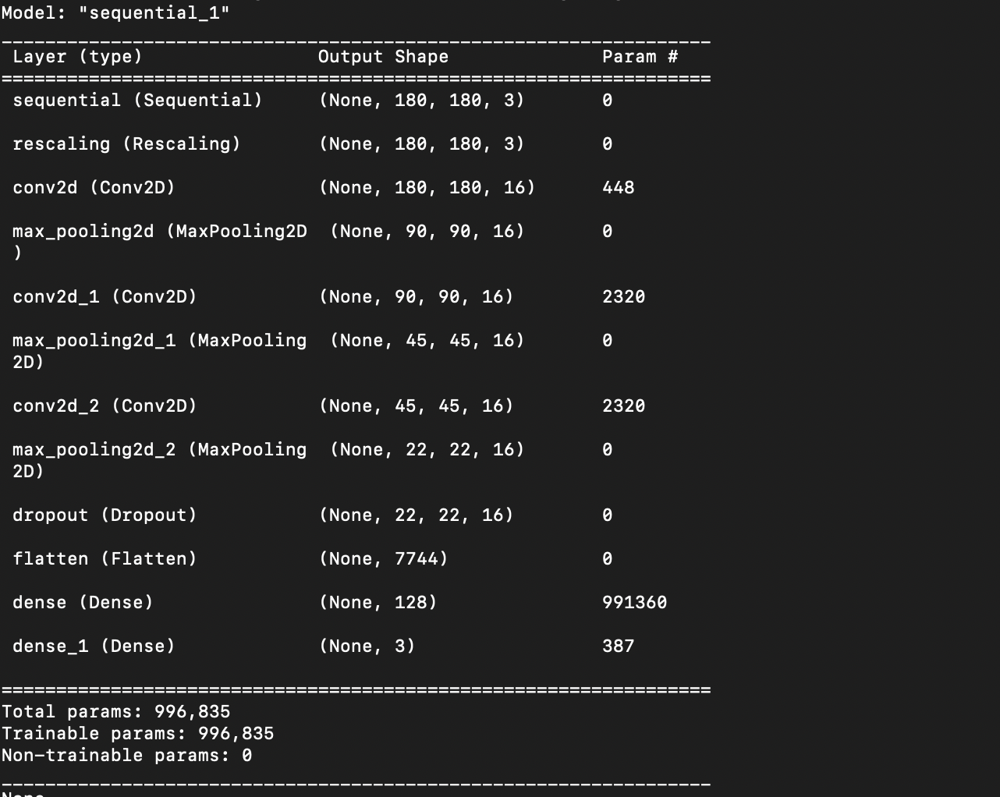
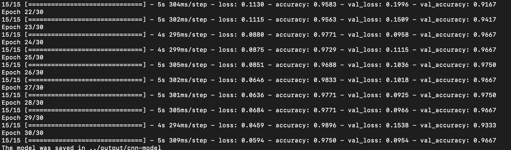

# Real-Time-Image-Classification

## Overview

### Business Problem

1. **Objective**
   - Build an Convolutional Neural Network capable of classifying images from a dataset containg driving licenses, social security cards amd miscellaneous items.  
   - This could be useful for companies requiring KYC documentation. 

2. **Technology**
   - Python, Scikit-learn, TensorFlow, Keras, Pandas, Numpy, Flask
   
4. **Metrcs**
   - Accuracy

5. **Deployment**
   - Deploy model in a scalable way so that business decisions can be taken in near real time in assessing riskiness of a transaction

6. **Approach**

   - Data Loading
   - Data Preprocessing
   - Build a baseline CNN model to classify images
   - Data Augmentation
   - Predictions
   - Model Deployment

```python Engine.py```
```
Train - 0
Predict - 1 
Deploy - 2
```
```
Enter your value: 0
```
```
Number of images for training: 600
Preprocessing has begun...
Found 600 files belonging to 3 classes.
Using 480 files for training.
....
Found 600 files belonging to 3 classes.
Using 120 files for validation.
Class Names: ['driving_license', 'others', 'social_security']
Data loading has completed...
Preprocessing is complete...
```




```
Enter your value: 1
```
```
Number of images for testing 150
Found 150 files belonging to 3 classes.
```


```
Enter your value: 2
```
```
1/1 [==============================] - 0s 333ms/step
127.0.0.1 - - [11/Dec/2022 14:02:30] "POST /get-image-class HTTP/1.1" 200 -
```
***Real Time Prediction***
